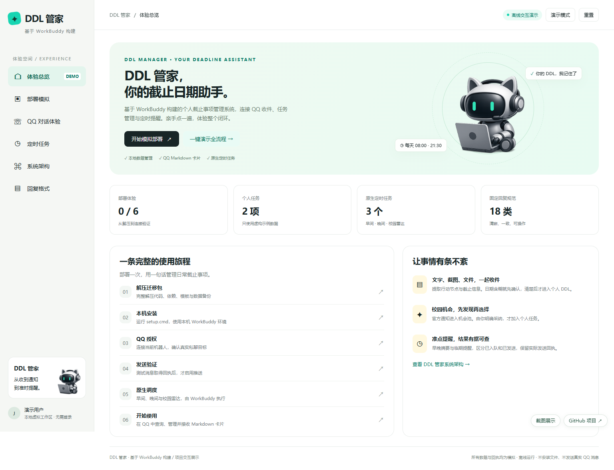
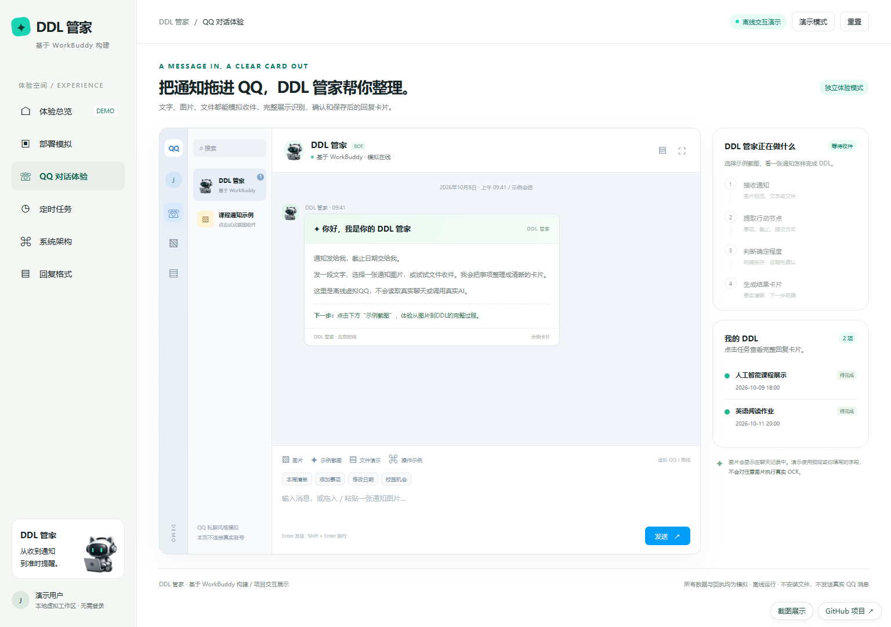
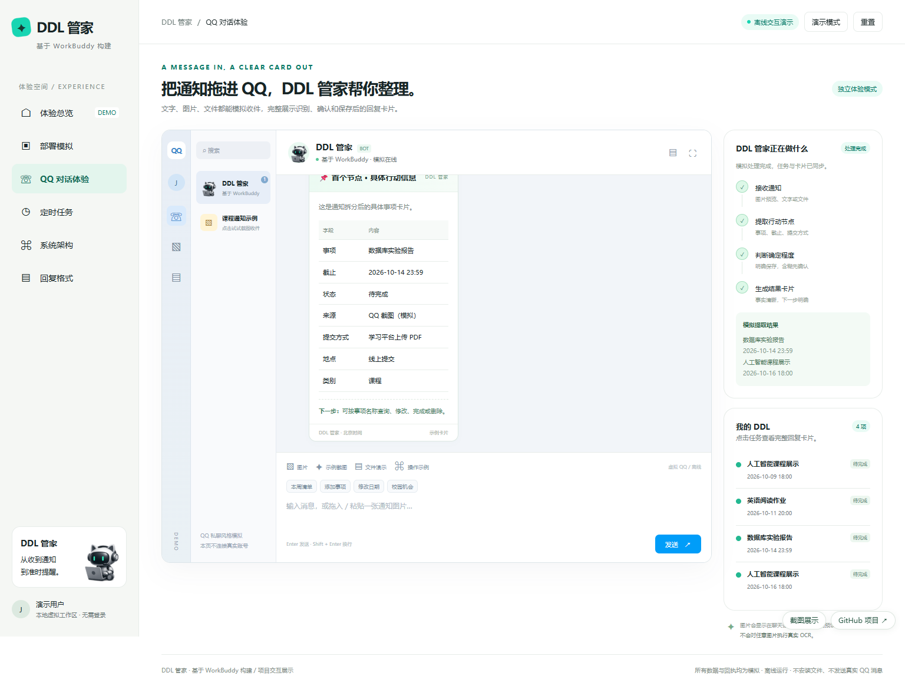
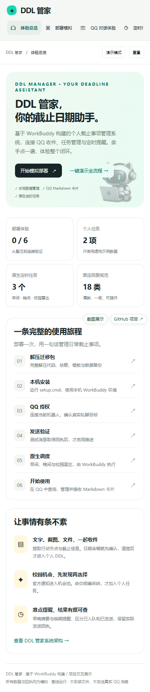
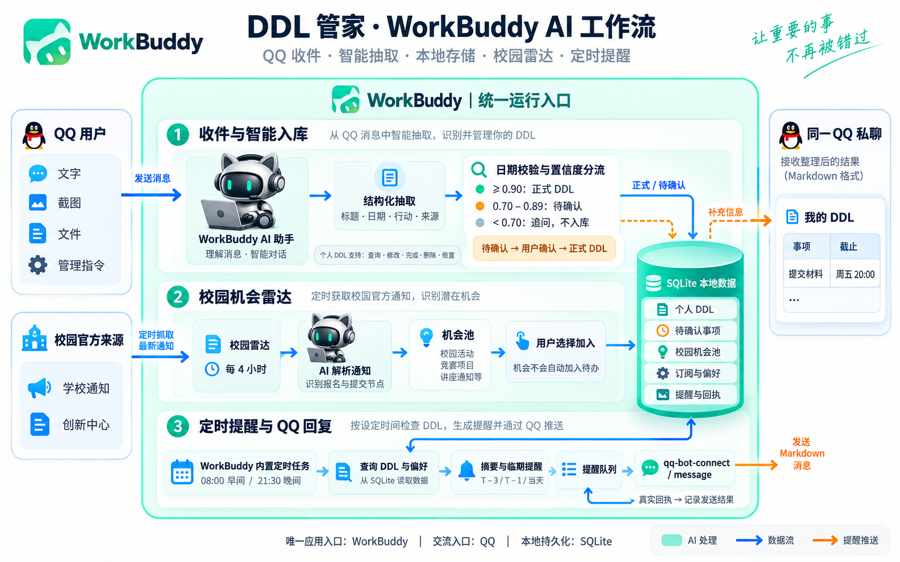

# DDL 管家 · WorkBuddy

用 QQ 收集通知和截止日期，通过 WorkBuddy 管理任务、校园机会和提醒。

**[打开在线交互演示](https://jcduann.github.io/workbuddy-ddl-manager/)** · **[截图与架构展示](https://jcduann.github.io/workbuddy-ddl-manager/gallery.html)** · **[下载 Windows 安装包](https://github.com/JCDuann/workbuddy-ddl-manager/releases/latest)**

## 页面预览

### 体验总览


### QQ 对话与图片通知



### 手机展示


## 核心功能

- SQLite 持久化，任务增删改查、完成、软删除恢复、重复事项与审计。
- 日期校验和置信度分流：正式事项、待确认事项、追问补充。
- QQ Markdown 卡片，18 类统一回复模板。
- 校园官方通知雷达，机会经用户选择后加入个人待办。
- WorkBuddy 本地原生调度：08:00 早间摘要、21:30 晚间复盘、每 4 小时雷达。
- QQ 推送去重、发送队列及真实平台回执核查。

## 演示与实际运行

在线网页是可交互的项目演示，包含部署流程、QQ 对话、图片通知、定时任务、系统架构与回复模板。网页不连接真实 AI、QQ 或校园官网；图片提取、授权和回执是模拟，上传图片仅在本页预览。详细说明见 [DEMO.md](docs/DEMO.md)。

实际程序在 Windows 本机的 WorkBuddy 中运行。GitHub Pages 托管展示网页；实际 QQ 连接、数据库与本地定时任务由安装包提供，需要在自己的电脑上部署并验证。

## 安装

1. 从 [Releases](https://github.com/JCDuann/workbuddy-ddl-manager/releases/latest) 下载公开安装包并完整解压。
2. 在新电脑登录 WorkBuddy、连接自己的 QQ 机器人，然后退出 WorkBuddy。
3. 运行 `setup.cmd`，打开 WorkBuddy 给机器人发一句话，再按需运行 `qq-setup.cmd` 完成本机验证。
4. 运行 `check.cmd`，核查 QQ 收件、测试卡片与首次定时执行。

完整说明见 [portable/README.md](portable/README.md)。公开安装包从空白数据库开始，个人数据和 QQ 授权须在本机建立。

## 源码开发

源码位于 `portable/app/`，核心 Python 工具使用标准库；QQ 依赖版本在 `portable/app/runtime/package-lock.json` 固定。

```powershell
cd portable/app/runtime
npm ci
cd ../../..
python scripts/refresh_manifest.py
cd portable/app
python -m unittest test_ddl test_cards -v
cd ..
$env:DDL_TEST_NODE = (Get-Command node).Source
python -m unittest test_deploy -v
```

修改安装文件后重新生成 manifest。测试只使用隔离临时目录，不向真实 QQ 发送消息。

## 系统架构



## 发布内容

| 路径 | 内容 |
| --- | --- |
| `docs/index.html` | 可直接打开的完整交互演示 |
| `docs/gallery.html` | 截图与架构展示页 |
| `docs/screenshots/` | 桌面、手机、QQ、部署、任务和架构截图 |
| `portable/app/` | 运行源码与回复规范 |
| `portable/` | Windows 安装、自检、QQ 配置和导出入口 |
| `scripts/refresh_manifest.py` | 更新安装文件 SHA-256 校验清单 |

未发布原目录中的个人数据库、账号配置、登录授权、聊天日志及包含个人资料的旧压缩包。仓库没有声明 WorkBuddy、QQ 或其品牌素材的所有权；相关名称与界面用于说明集成方式，项目演示不代表官方产品。
